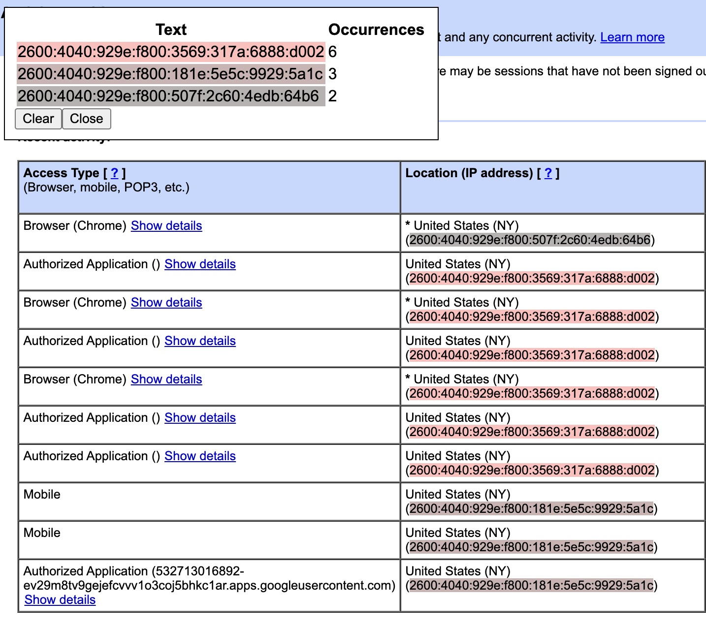
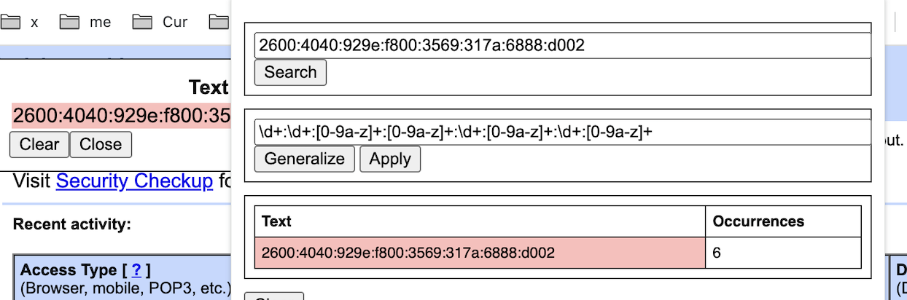

# Usage

1. Select the text for which you'll search

    

1. Click "Find Similar Text"

    

    If all goes well you'll see a histogram in the left corner and this text and similar highlighted.

    

1. If you didn't get what you want, e.g. a cluster of numbers made the regexp too strict:

    

    1. You can go to the popup and (1) manually refine the regexp or click "Generalize" to try to capture more

        

    2. And hope to capture what you wanted

        

## Install

Clone repo and install as an unpacked extension from the `chrome` directory.
