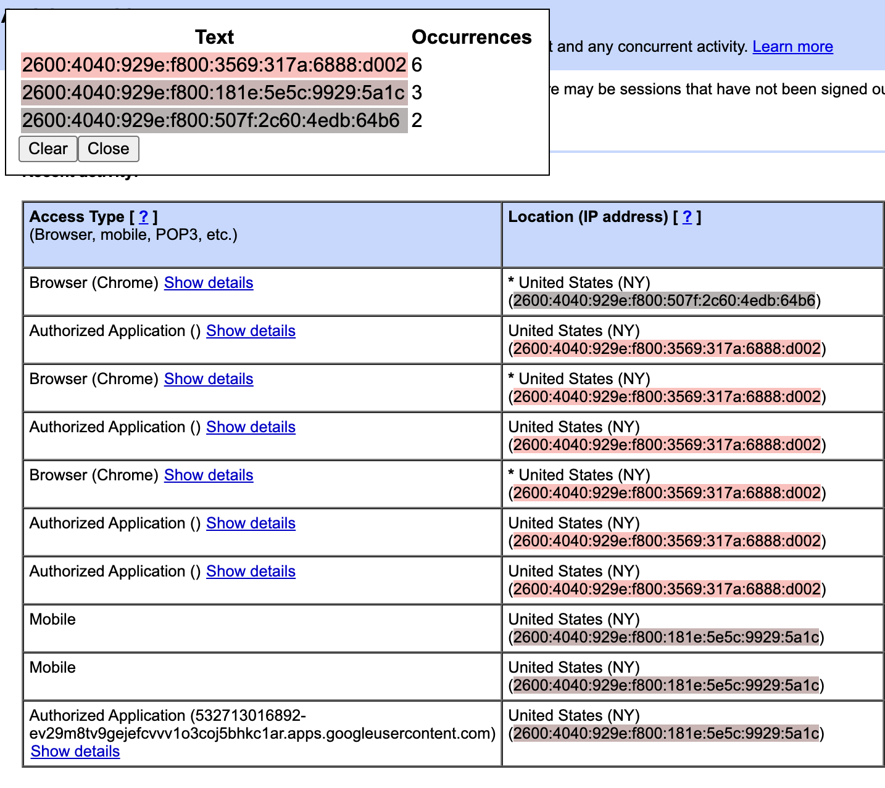

# Select Similar Chrome Extension

## Motivation

You see an ipv6 address and want to know others on the page, e.g.

## Overview

1. Select text
2. Find simlar text on the page
3. Maybe refine the search to get better results.

More detailed usage [here](doc/usage.md).

When you select text that text is converted to a regular expression using really stupid logic and then that regexp is used to search for other text. You can manually refine the regexp and allow use even stupider logic to "generalize" it. Here, by "generalize" we look at clusters of characters converted a regexp (say numbers -- `\d+`) and if there are other "more general" clusters (say numbers and letters `[\da-zA-z]+`), we'll convert to the latter for all.

## Install

Clone repo and install as an unpacked extension from the `chrome` directory.
