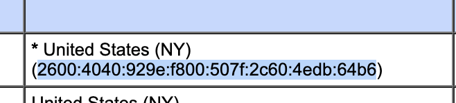
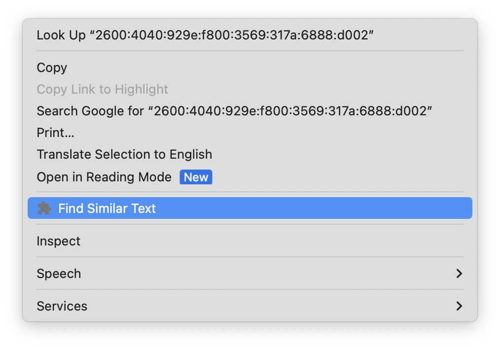
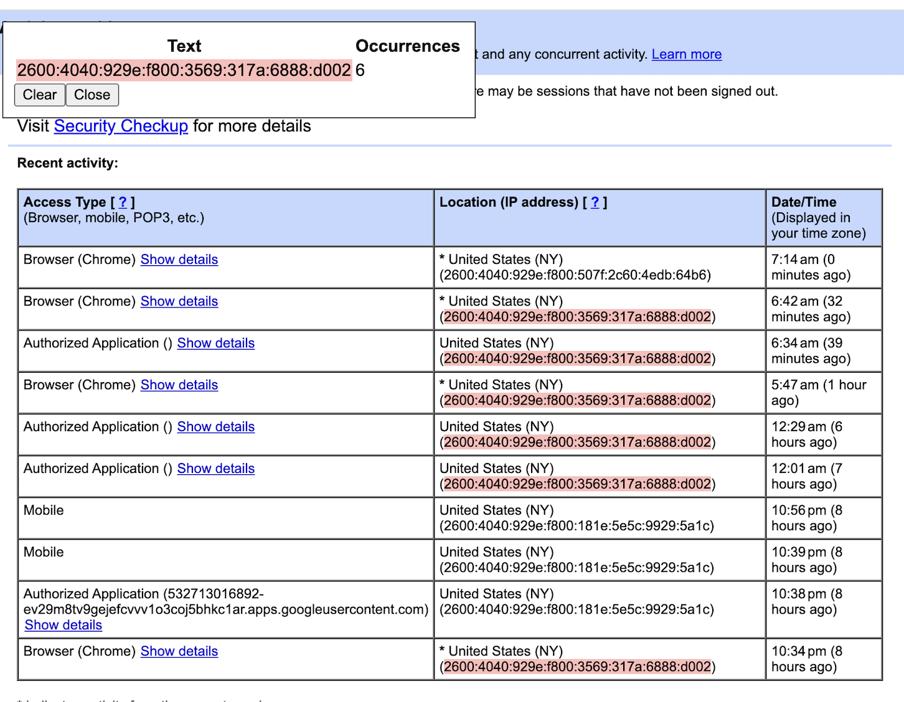
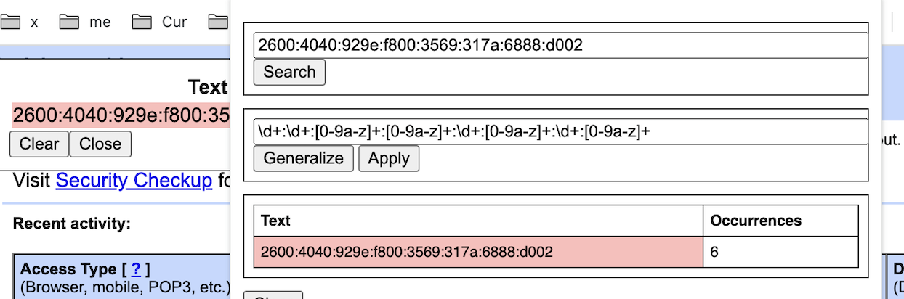
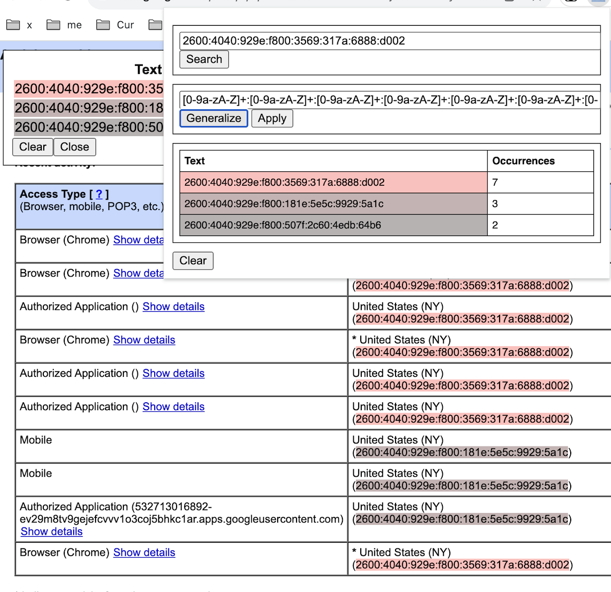

# Select Similar Chrome Extension

## Motivation

You'd like to select some text on a page and see all "similar" text, how often each text string shows up and it similarity.

NOTE: This isn't *really* motivation, it's just what this does. So, I'm telling you that you're motivated to do this.

### Example

You want to find all ipv6 addresses.

## Overview

When you select text that text is converted to a regular expression using really stupid logic and then that regexp is used to search for other text. You can manually refine the regexp and allow use even stupider logic to "generalize" it. Here, by "generalize" we look at clusters of characters converted a regexp (say numbers -- `\d+`) and if there are other "more general" clusters (say numbers and letters `[\da-zA-z]+`), we'll convert to the latter for all.

## Usage

1. Select the text for which you'll search

    

1. Click "Find Similar Text"

    

    If all goes well you'll see a histogram in the left corner and this text and similar highlighted.

    

1. If you didn't get what you want, e.g. a cluster of numbers made the regexp too strict:

    

    1. You can go to the popup and (1) manually refine the regexp or click "Generalize" to try to capture more

        

    2. And hope to capture what you wanted

        

## Install

Clone repo and install as an unpacked extension.
